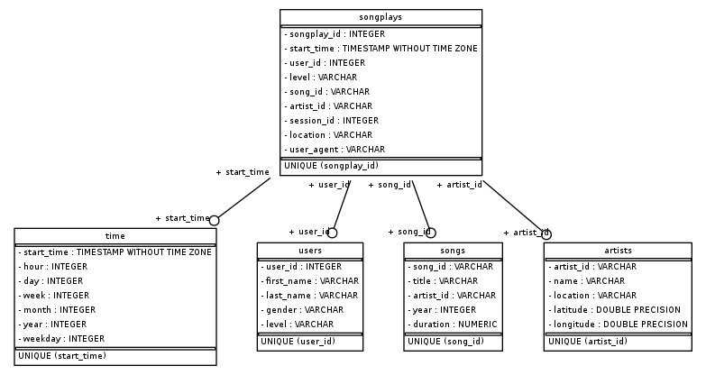

# Data Modeling with Postgres

A startup called Sparkify wants to analyze the data they've been collecting on songs and user activity on their new music streaming app. The analytics team is particularly interested in understanding what songs users are listening to. Currently, they don't have an easy way to query their data, which resides in a directory of JSON logs on user activity on the app, as well as a directory with JSON metadata on the songs in their app.

This project  applies data modeling with Postgres and build an ETL pipeline using Python. It defines fact and dimension tables for a star schema for a particular analytic focus, and an ETL pipeline that transfers data from files in two local directories into these tables in Postgres using Python and SQL.

# How to run python scripts
- Run first the script `create_tables.py` to create the database and the tables with the command `python3 create_tables.py`.
- Run the script `etl.py` to run the ETL pipeline to extract , process and load the data in the database tables with the command `python3 etl.py`.

StackEdit stores your files in your browser, which means all your files are automatically saved locally and are accessible **offline!**

## Files
- `create_tables.py` drops and creates the tables. This file must run to reset the tables before each time before running the ETL scripts.
- `etl.py` reads and processes files from `song_data` and `log_data` and loads them into the tables.
- `sql_queries.py` contains all the sql queries, and is imported into the ETL scripts.
- `test.ipynb` displays the first few rows of each table to let you check the database.
- `etl.ipynb` reads and processes a single file from `song_data` and `log_data` and loads the data into the tables. This notebook contains detailed instructions on the ETL process for each of the tables.